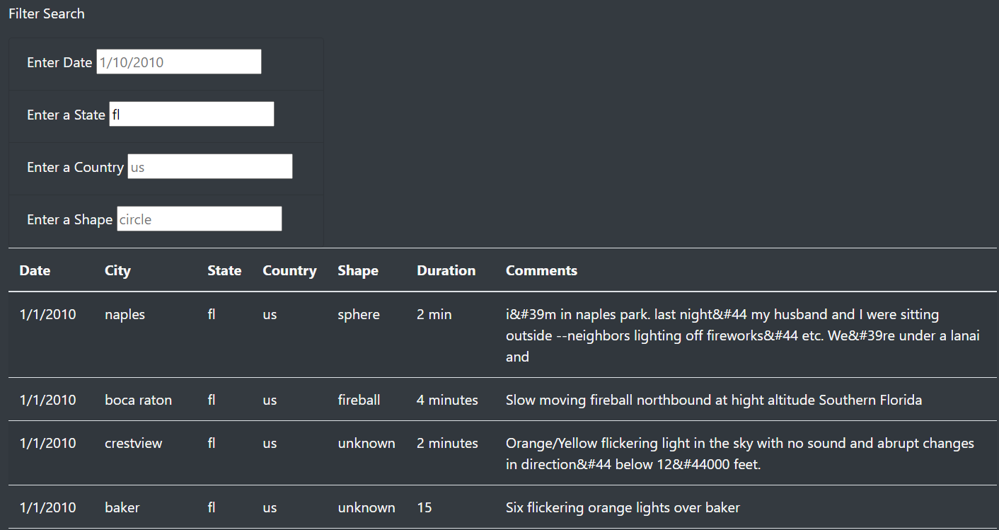

# UFOs

# Overview of the analysis:
- In this analysis we used JavaScript, HTML, and Bootstrap to create a interactive web page that allows users to search for information on UFO sightings. Users will be able to see a table displayed with data such as a date, city, state, country, shape, duration, and comments on each UFO siting reported.

# Results
- As shown in the image below you can see that the users are able to filter the table by searching by date, state, country, and shape of the UFO. Once the user enters in the specific filter they would like to see the table is automatically filtered based on what they entered. 

# Summary 
- One of the drawbacks to this page is that the data we have will not be updated so if there is new sightings reported we would have to manually enter the new information. One recommendation for future development that will assist with this drawback would be to implement webscrapping so that the data will be up to date without needing to manually update it. Another recommendation for future development would be to add in a column to our table for longitude and lagitude to be able to know the exact location of the sighting other than just showing the city and state. 
